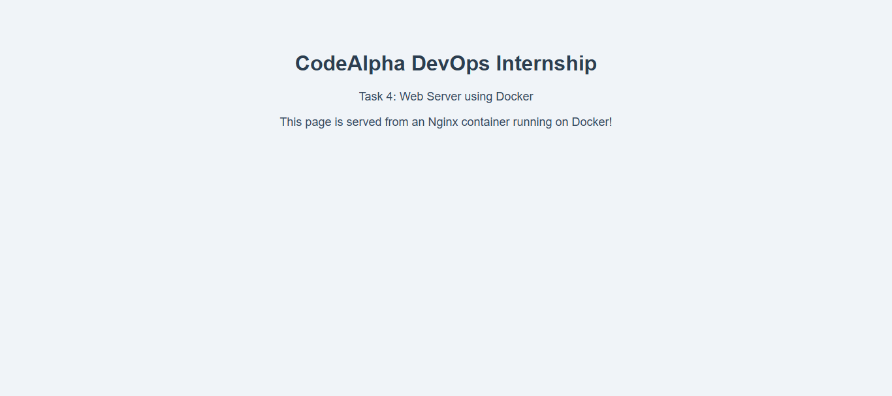
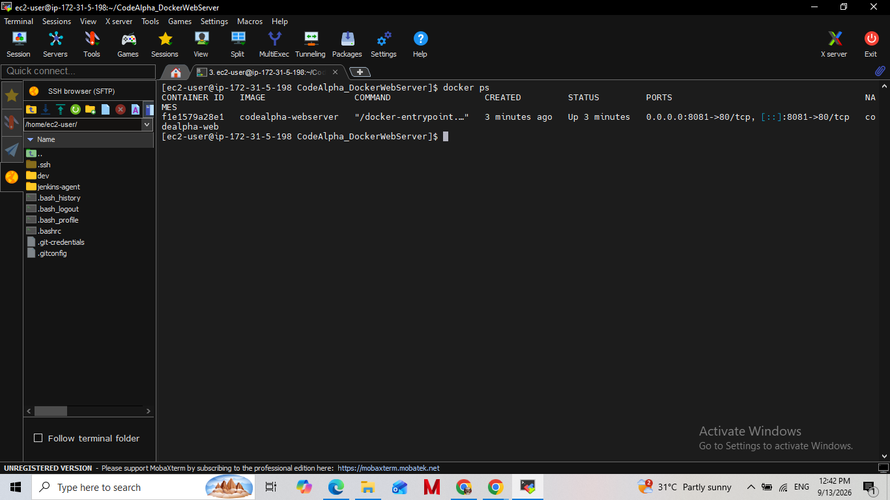

# CodeAlpha Docker Web Server

## Overview
A simple web server built using Docker and Nginx. The project demonstrates Docker containerization basics, custom image building, container lifecycle management, and deployment of a web application inside a Docker container on an AWS EC2 instance.

## Tech Stack
- Docker 29.8.0
- Nginx (alpine)

## How to Build and Run

### Build the image

### Run the container

### Check running containers

### View logs

## Screenshots

### Custom Web Page Running in Browser

### Docker Container Status

## Result
The web server was successfully containerized and deployed using Docker, confirming proper understanding of Docker containerization, image building, and container lifecycle management.
